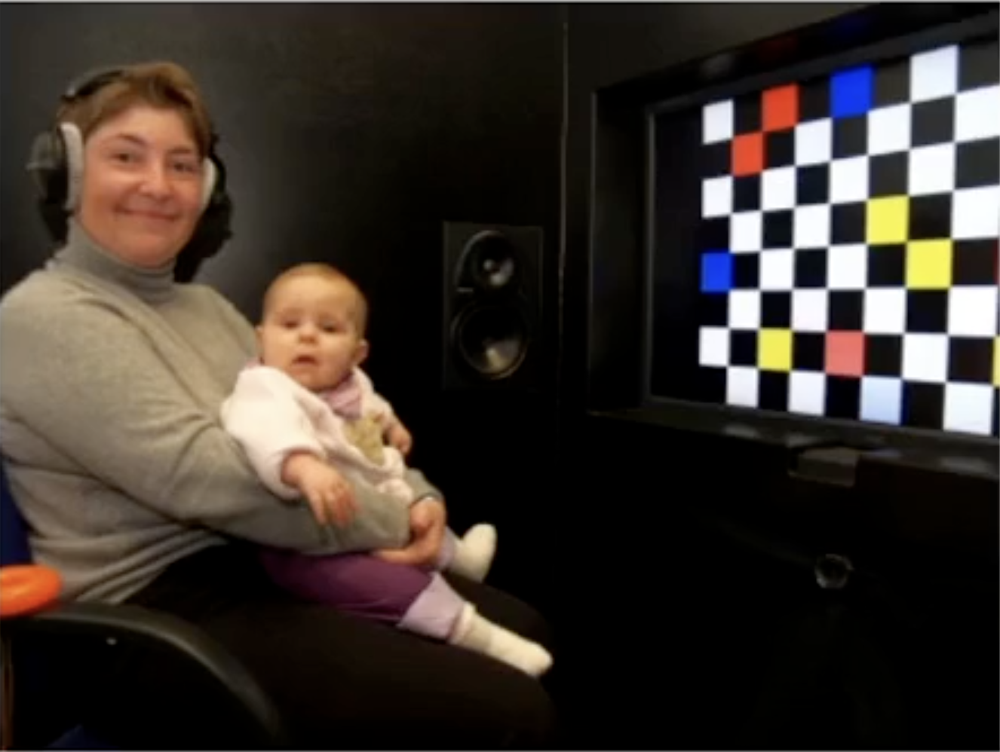

# How Children (and LLMs) Learn Languages

  {{ reading_stats(page.markdown)['time'] }} · {{ reading_stats(page.markdown)['words'] }} (excl. titles, captions)

Playing with my baby cousin means listening to nonsensical utterances that
barely resemble words - much like the outputs of an untrained [LLM](https://www.cloudflare.com/en-gb/learning/ai/what-is-large-language-model/). This got me thinking: how do children learn languages, and is it in any way
similar to training an LLM?

<figure style="text-align: center">  <figcaption><a href="https://xkcd.com/2839/">XKCD 2839: Language Acquisition</a></figcaption> </figure>

## Language is acquired in phases

Child language development (CLD), a branch of linguistics, is clear that
languages are acquired in distinct phases. Children spend their first two months
crying and grunting (_reflexive vocalisation_) before moving on to cooing.

Then, they _babble_, which is what I heard my cousin doing.
After 12-14 months, children start to form words. As time
continues, their [**mean length of utterance**](https://pubs.asha.org/doi/abs/10.1044/jshr.2402.154) (a common quantitative measure in
child linguistic studies) increases.

<figure style="text-align: center">  <figcaption>A (simplified) diagram showing the key stages of language acquisition.</figcaption> </figure>

In the two-word stage, children produce utterances **in correct grammatical
order**, which suggests they have learned (or, perhaps,
[innately have](#nativism-behaviourism-and-llms)) grammatical structure.

Interestingly, these typical developmental milestones don't vary across
language or mode. Signing children will learn to sign in the same recognisable
phases as their speaking counterparts at the same rate (aside from at the [the one-word stage](https://doi.org/10.1353/sls.1979.0005)).

<figure style="text-align: center">
  <iframe width="560" height="315" src="https://www.youtube.com/embed/s3gqI_lCXQ0" 
          title="Baby babbling in sign language / signing in ASL" frameborder="0" 
          allow="accelerometer; autoplay; clipboard-write; encrypted-media; gyroscope; picture-in-picture; web-share" 
          allowfullscreen></iframe>
  <figcaption>Baby babbling in sign language (ASL).</figcaption>
</figure>

Physiology clearly affects how quickly children can produce language.
Interestingly, **physiology also impacts how children perceive language**.

## Children and their receptive language ability

Children up to a year old are **universal phoneme detectors** -
they can differentiate between sounds from any language. Adults, in
comparison, are not able to differentiate between some sounds in their
non-native languages.

A common example is the voiced alveolar plosive, **/d/**, vs the
voiced dental plosive, **/d̪/**. The former is common in English, whereas the
latter is not found in English but in Hindi.

<figure style="text-align: center">  <figcaption>A child and their caregiver about to undergo a head turn test.</figcaption> </figure>

Conditional head turn tests show that hearing English infants can
differentiate the two sounds up till a year old. After that, no difference.

This tuning suggests that the stimulus children have when acquiring language
can vary wildly after a year. A key debate in CLD is whether children learn
language only from this stimulus, or if there is some innate machinery that
we all have which predisposes us to learn language.

## Nativism, Behaviourism, and LLMs

Behaviourism was pioneered in psychology in a [1913 paper](https://www.ufrgs.br/psicoeduc/chasqueweb/edu01011/behaviorist-watson.pdf) by John B. Watson.
Behaviourists argue that _the stimulus_ (language input) alone is responsible
for children learning language. That is, we have no _"built-in"_ understanding
of the structure of language and only learn via reinforcement.

Nativists like Chomsky argue that children must have innate grammar knowledge.
They cite the **poverty of the stimulus**: language input lacks enough information
to explain how children learn complex rules, especially since infants rarely
hear ungrammatical sentences.

LLMs pose an interesting question for Nativists: working with the same poor
stimulus, LLMs are clearly excellent tools for manipulating language. LLMs
are often trained in a [weakly supervised](https://en.wikipedia.org/wiki/Semi-supervised_learning) way by exposure to massive text
samples without labels or grammatical feedback.

<figure style="text-align: center">  <figcaption>Vector Embeddings: Taken from <a href="https://towardsai.net/p/machine-learning/a-complete-guide-to-embedding-for-nlp-generative-ai-llm">Towards AI</a>.</figcaption> </figure>

Furthermore, LLMs represent semantics as embeddings in high-dimensional vector
spaces, not as grammar rules as a Nativist may claim. Does this mean the
existence of ChatGPT proves behaviourism?

## Takeaway: Birds Aren't Aeroplanes

Not quite. The comparison between how LLMs encode language and how humans learn
it isn’t all that meaningful. There are clear similarities, but more
differences - especially in the volume of data LLMs are exposed to.

I think this article can be summed up by the popular analogy:

> _"One wouldn't study an aeroplane to gain understanding about how
> birds fly."_
